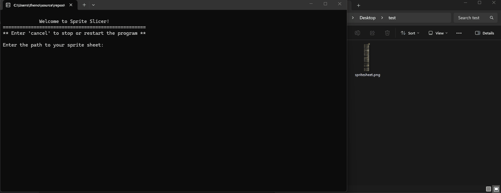

# Sprite Slicer

A command-line tool for slicing sprite sheets into individual images by row, with support for variable stage counts and row heights. Built in C# for Windows.

## Features

- Variable stage count and row height per row
- Set default stages and height to speed up repetitive sheets
- Custom output folder with automatic creation option
- File conflict detection with overwrite prompt
- Optional suffix applied to all output file names
- Jump to a specific row to resume interrupted sessions
- Enter 'cancel' at any prompt to restart the process

## Requirements

- Windows 10 or later
- No installation required - runs as a standalone executable

## How It Works
flowchart TD
    A([Start]) --> B(Enter sprite sheet path)
    B --> C(Enter output folder)
    C --> D(Enter stage width)
    D --> E(Set defaults - optional)
    E --> F(Set suffix - optional)
    F --> G(Jump to row - optional)
    G --> H(Row loop)
    H --> I{Y < total height?}
    I ---> |no| K([End])
    I --> |yes| J(Process row)
    J --> L(Enter number of stages - or default)
    L --> M(Enter row height - or default)
    M --> N(Enter image name - or default)
    N --> O{File exists?}
    O --> |no| Q
    O --> |yes| P{Overwrite?}
    P --> |yes| Q(Slice and save)
    P --> |no| N
    Q --> R(Advance Y position)
    R --> I

## Usage

1. Download 'SpriteSlicer.exe' from the [releases page](https://github.com/nova-denton-parry/SpriteSlicer/releases/latest) and run it
2. Enter the path to your sprite sheet when prompted (you can paste directly from File Explorer using *Copy as path*)
3. Enter the output folder path where sliced images will be saved
4. Enter the width of each individual stage in pixels
5. Optionally set default values for stage count and row height
6. Optionally add a suffix to all output file names (e.g. '_plant_watered')
7. For each row, enter the number of stages, row height, and a name for the output file (optional: defaults to row number)
8. Press Enter to accept default values where applicable

## Notes

- Enter 'cancel' at any prompt to stop (and optionally restart) the program
- Paths can be pasted with or without surrounding quotes (Windows' *Copy as path* feature automatically includes quotes)
- If the output folder doesn't exist, you will be prompted to create it
- If an output file already exists, you will be prompted before overwriting
- The program stops automatically when the entire sprite sheet has been processed
- To resume an interrupted session, use the jump to row feature and reference the Y position printed at the start of each row

## Building from Source

If you'd like to build the project yourself:

1. Clone the repository
2. Open 'SpriteSlicer.slnx' in Visual Studio 2022 or later
3. Install dependencies via NuGet (SixLabors.ImageSharp)
4. Build and run
